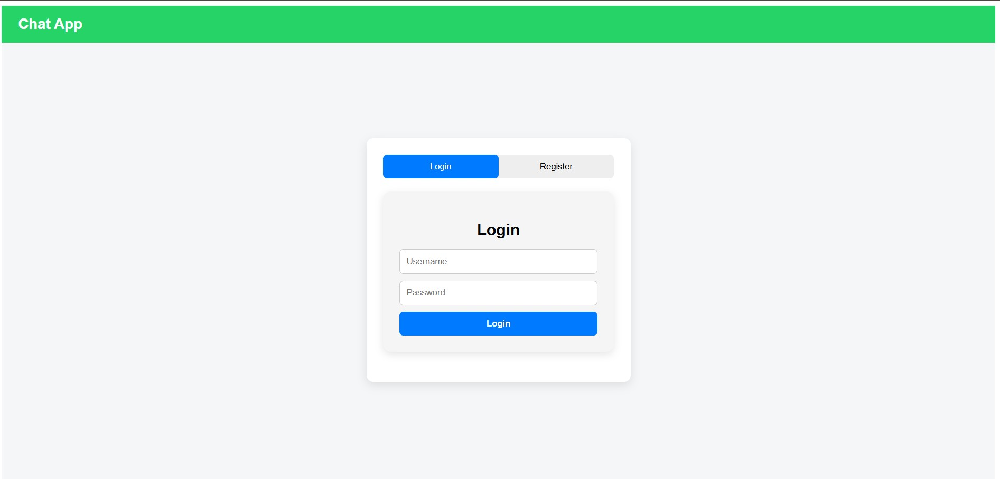
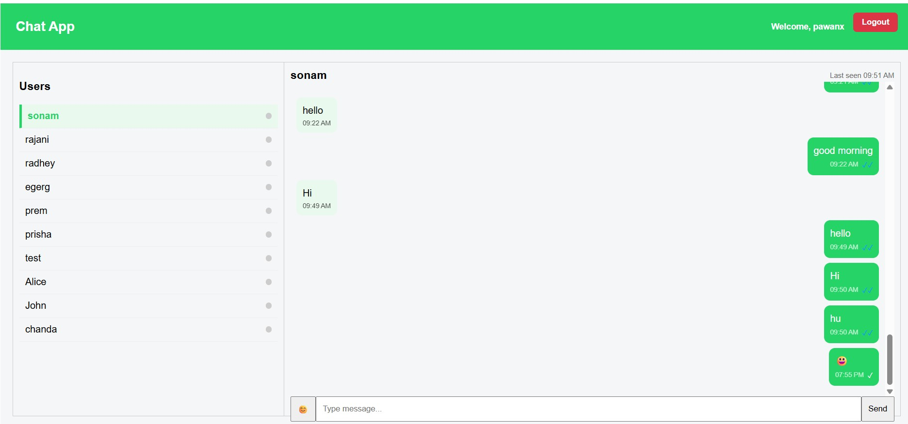

# ChatConnect - Real-Time Messaging Platform

A full-stack real-time chat application that enables users to register, log in securely, and communicate instantly through a seamless messaging interface.

Built with a React frontend, Node.js/Express backend, MongoDB database, and secure JWT authentication for smooth and protected communication.

---

## Demo Link

[Live Demo](https://chat-app-frontend-jd6g.vercel.app/)

---

## Quick Start

```bash
git clone https://github.com/pawanx/chat-app-frontend.git
cd chat-app-frontend
npm install
npm run dev
```

---

## Technologies

- React JS
- React Router
- Node.js
- Express.js
- MongoDB
- Mongoose
- JWT Authentication
- bcrypt
- Axios
- REST APIs

---

## Features

## Authentication

- Secure user registration and login
- Password hashing using bcrypt
- JWT-based authentication
- Protected routes
- Persistent user sessions
- Token expiration security

---

## User Registration

- Create new account securely
- Input validation for all fields
- Duplicate user prevention
- Automatic token generation after registration

---

## User Login

- Existing user authentication
- Credential validation
- Secure session token generation
- Instant access after login

---

## Messaging System

- Instant user communication
- Smooth message exchange
- Clean chat interface
- Secure authenticated messaging

---

## Security

- Password encryption using bcrypt
- Secure JWT token authentication
- Token expiration after 4 hours
- Backend route protection
- Error handling and validation

---

## Responsive UI

- Clean modern interface
- Mobile-friendly design
- Smooth navigation
- Optimized user experience

---

## Screenshots

## Login Page



---

## Chat Interface



---

## API References

### **POST /api/auth/register**

Register a new user

Sample Response:

```json
{
  "token": "jwt_token",
  "user": {
    "username": "pawan",
    "_id": "507f1f77bcf86cd799439011"
  },
  "message": "User Registered successfully."
}
```

---

### **POST /api/auth/login**

Authenticate existing user

Sample Response:

```json
{
  "message": "Login successful.",
  "user": {
    "username": "pawan",
    "_id": "507f1f77bcf86cd799439011"
  },
  "token": "jwt_token"
}
```

---

### **Error Response**

```json
{
  "message": "Invalid Credentials"
}
```

---

## Project Architecture

### Frontend:
- React
- Routing
- API Integration
- Authentication State Management

### Backend:
- Express Server
- JWT Authentication
- Route Validation
- Password Encryption Middleware

### Database:
- MongoDB Atlas
- User Schema Management

---

## Folder Structure

```bash
chat-app/
│
├── frontend/
│   ├── src/
│   ├── components/
│   ├── pages/
│
├── backend/
│   ├── routes/
│   ├── models/
│   ├── middleware/
│   └── server.js
│
└── README.md
```

---

## Environment Variables

Create a `.env` file:

```env
MONGO_URI=your_mongodb_connection_string
JWT_SECRET=your_secret_key
PORT=5000
```

---

## Future Improvements

- Socket.io integration
- Real-time live messaging
- Typing indicators
- Online/offline user status
- Group chat support
- File sharing
- Push notifications

---

## Contact

For bugs, collaboration, or feature requests:

📧 **Email:** pawanmishra196@gmail.com

🔗 **Portfolio:** https://portfolio-pawanx.vercel.app

💼 **LinkedIn:** https://www.linkedin.com/in/pawan-mishra-08b3b9133/